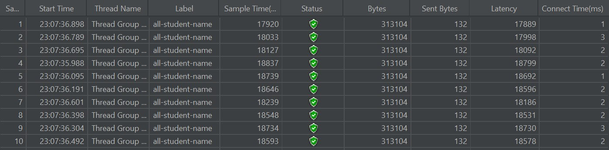
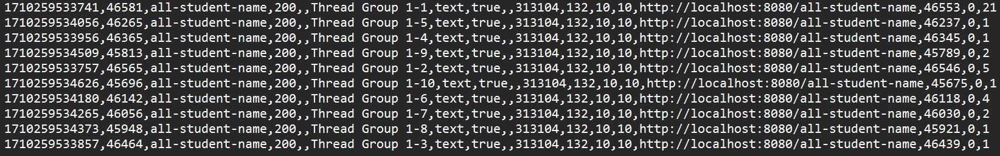
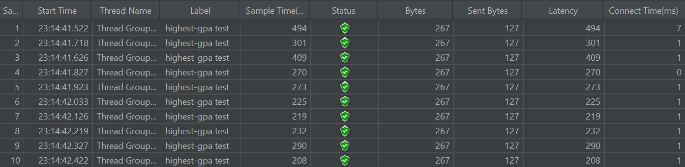
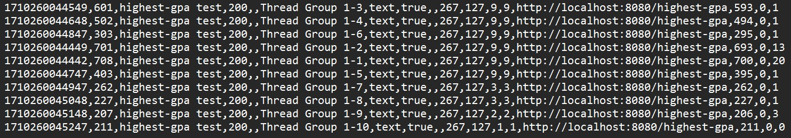
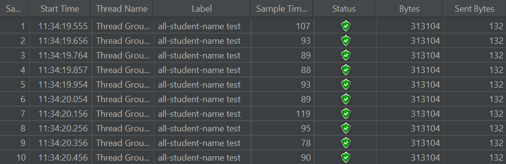
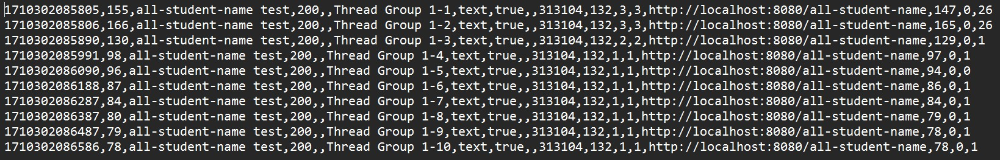
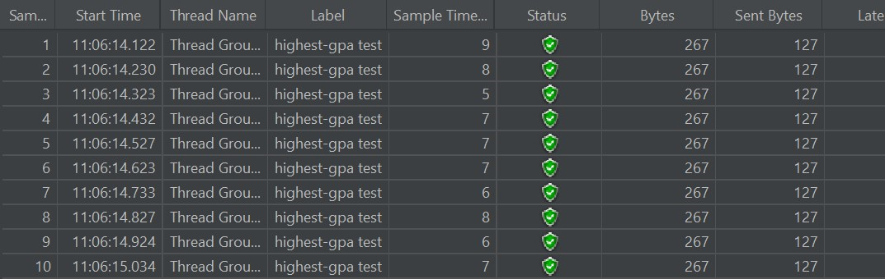
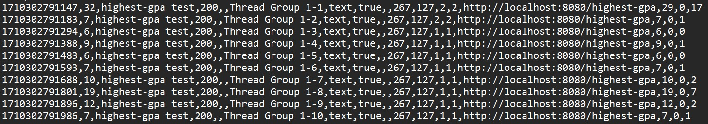

<h3>Tutorial 5</h3>
Before optimization:

After optimization:

<h4>Reflection</h4>
<ol>
<li>What is the difference between the approach of performance testing with JMeter and profiling with IntelliJ
Profiler in the context of optimizing application performance?
 
Answer: After trying both approaches, it seems that
Intellij Profiler is great for pinpointing areas that need optimizing
from an internal viewpoint, on the developer's side. On the
other hand, JMeter is useful for simulating how the program
would perform in reality as it simulates interactions with the program.</li>
<li>How does the profiling process help you in identifying and understanding the weak points in your application? 
Answer: The profiling process analyzes various aspects of program operation
during runtime like CPU usage, memory allocation, and threads' activity of
the program. Profiling can show us what parts of our application take up
the most time and resources to run, so we can pinpoint exactly where the weak
points are.</li>
<li>Do you think IntelliJ Profiler is effective in assisting
you to analyze and identify bottlenecks in your application code? 
Answer: I think it is very effective. The profiler can easily
be used during development, so I can check for bottlenecks in real-time which
I find very convenient.</li>
<li>What are the main challenges you face when conducting performance testing
and profiling, and how do you overcome these challenges? 
Answer: One of the biggest challenges when it came to conducting
performance testing and profiling is how I couldn't always figure out how
to optimize something immediately, even if the Profiler let me know what method
needed improvement. All I can do to work on it is keep working on my programming skills.</li>
<li>What are the main benefits you gain from using IntelliJ
Profiler for profiling your application code? 
Answer: One of the things I appreciate the most about the profiler is how
convenient it is as it allows me to work on my code and analyze it in the same
window. When I find a bottleneck in the profiler, I can get to where it is in my code
immediately and get to fixing it. I can save and view recent snapshots and
compare them in order to see if I've made any significant improvements in the performance
of each part of the program. The visualizations of the profiling are also helpful
in making the analysis feel more understandable and intuitive.</li>
<li>How do you handle situations where the results from profiling with
IntelliJ Profiler are not entirely consistent with findings from
performance testing using JMeter? 
Answer: Since they take different approaches in analyzing performance,
it wouldn't be too surprising to find differences. If the inconsistency isn't significant,
it could be the result of the different approach they take. If they are significant, it's best to
verify them again. Additionally, the inconsistency on JMeter's part could be caused by
server traffic and network issues, so I would probably try again.</li>
<li>What strategies do you implement in optimizing application code after
analyzing results from performance testing and profiling? How do you ensure the changes
you make do not affect the application's functionality? 
Answer: I find what part of the code is the most problematic performance-wise
with the help of profiling and try to find a way to improve it. I would test it again with JMeter
and Intellij Profiler and see if it's improved. I would also make sure that the changes
don't affect the program's functionality by making sure my changes produce equivalent
results with the previous version of the code.</li>
</ol>
